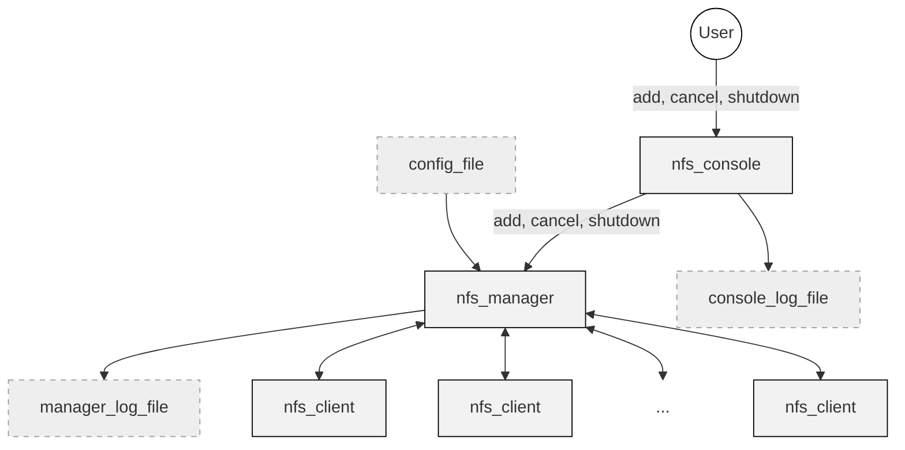

# Network File System (NFS)

## Project Overview

This project implements a Network File System (NFS) for real-time file synchronization between remote systems. It utilizes low-level socket programming, multi-threading with a worker thread pool, and synchronization primitives like condition variables to manage file transfers between source and target directories hosted on different machines.

## Implementation & Design Choices

### 1. Networking & Communication Protocol
* **Socket Messaging**: All communication is performed over blocking sockets using a custom messaging protocol. Messages consist of a prefix indicating the size, followed by the data payload.
* **Protocol Commands**:
    * `LIST <dir>`: Requests a file list from an `nfs_client`.
    * `PULL <path>`: Downloads file content from a source.
    * `PUSH <path> <chunk_size> <data>`: Uploads data chunks to a target.
* **Connection Management**: To ensure clean termination, `shutdown(fd, SHUT_WR)` is called before closing sockets when a sender finishes writing.

### 2. nfs_manager
* **Thread Pool**: Upon startup, the manager creates a pool of worker threads to handle file synchronization tasks concurrently.
* **Config File**: Upon startup, the manager reads from a config file a list of dir pairs (source and dest).
* **Task Management**: A shared buffer (size set via `-b`) stores synchronization requests. Access is synchronized using condition variables.
* **Job Tracking**: An internal map (`Jobs_record`) tracks active synchronization tasks to prevent duplicate entries if an `add` command is issued for an existing pair.
* **Console Thread**: A dedicated thread (`handle_console`) manages asynchronous commands from the `nfs_console`.

### 3. nfs_client
* **Multi-threaded Serving**: The client spawns a new thread for every incoming request to allow concurrent file operations.
* **Directory Synchronization**: Implements a reader-writer lock mechanism per directory to allow multiple concurrent readers but exclusive access for writers. 
* **Memory Management**: Directory locks are stored in a map using a combined key of `dev_t` and `ino_t`. A cleanup thread removes unused locks from the map when it exceeds 1000 entries.
* **Relative Paths**: All file operations are relative to the directory where the `nfs_client` is executed.

### 4. nfs_console
* **User Interface**: Parses user input and forwards commands to the `nfs_manager`.
* **Response Handling**: It is responsible for displaying the manager's status messages to the user and logging them locally.

---

## Compilation
```bash
make all
```
This produces three executables in the `./bin/` directory: `nfs_manager`, `nfs_client`, and `nfs_console`.

---

## Execution Instructions
**Note**: Programs should be started in the following order: `nfs_client`, `nfs_manager`, `nfs_console`.

### 1. nfs_client
```bash
./bin/nfs_client -p <port_number>
```
* `-p`: Port to listen for manager requests.

### 2. nfs_manager
```bash
./bin/nfs_manager -l <logfile> -c <config_file> -n <worker_limit> -p <port> -b <bufferSize>
```
* `-l`: System log file.
* `-c`: Configuration file with `source_dir@host_ip:port target_dir@host_ip:port` pairs.
* `-n`: Max concurrent worker threads (default: 5).
* `-p`: Port for console communication.
* `-b`: Size of the task buffer.

### 3. nfs_console
```bash
./bin/nfs_console -l <console-logfile> -h <manager_IP> -p <manager_port>
```
* `-l`: Console-specific log file.
* `-h`: IP address of the manager.
* `-p`: Port the manager is listening on.

---

## Console Commands
* `add <source> <target>`: Registers a new directory pair for synchronization.
* `cancel <source>`: Cancels pending synchronization tasks for the specified source.
* `shutdown`: Gracefully terminates the manager after finishing queued tasks.

---

## Logging Formats
* **Manager Log**: `[TIMESTAMP] [SOURCE DIR] [TARGET DIR] [THREAD PID] [OPERATION] [RESULT] [DETAILS]`.
* **Console Log**: Records user-issued commands and manager responses.

## Notes
* **Flat Directories**: The system assumes no subdirectories are present.
* **Empty Directories**: Empty directories are not synced.
* **Log Cleanup**: Log files are cleared at program startup to ensure fresh logging per session.

## Architecture


